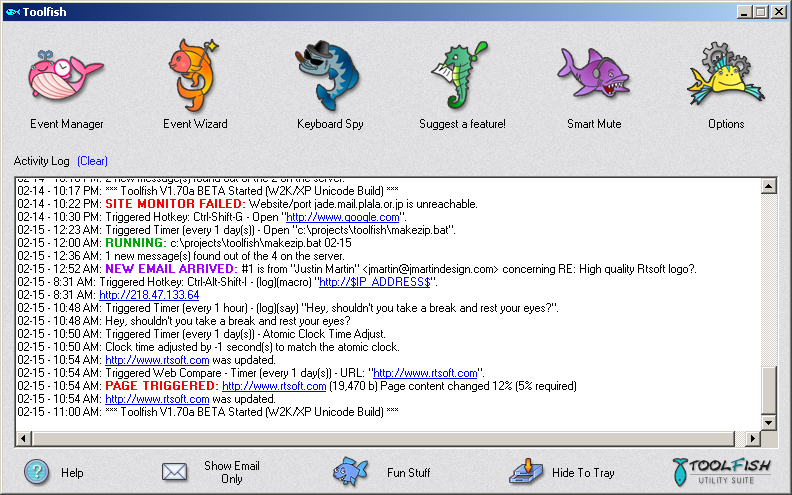
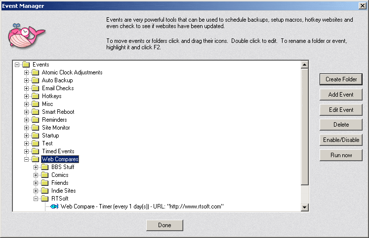
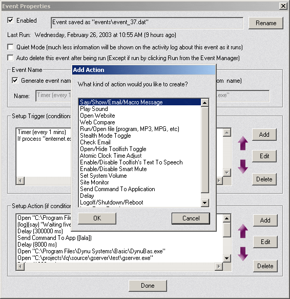

# Toolfish

A powerful Windows system tray utility for web monitoring, hotkeys, macros, and automation.

## [Download latest version](https://rtsoft.com/ToolfishFullInstaller.exe) (For Windows, signed by RTsoft)

## Screenshots

  
  
  

## Description

Toolfish is a swiss army knife feature-rich Windows system tray application that handles global hotkeys, macros, monitors websites for changes (percent changed detection), text-to-speech notifications, scheduled tasks, and much more.  

It has kind of an internal scripting system that allows you to specify "triggers" and "actions" to do stuff automatically on your computer.

This was a commercial app I released in 2002, eventually making free in 2015.  As of Feb 2026, it's now open source too!  Anytime I need a little utility to do something, I throw it into this app.  

It can be moved to a new computer very easily simply by copying its folder.

## Features

### Web Monitoring
* **Web Compare** - Monitor websites for changes using fuzzy logic (percent changed detection)
* **Site Monitor** - Track server uptime with ping statistics and timeout detection
* **Keyword Detection** - Trigger alerts when specific words appear or disappear from pages

### Automation & Scheduling
* **Global Hotkeys** - Assign any key combination to trigger actions
* **Macros** - Paste predefined text, IP addresses, or custom messages anywhere
* **Scheduled Tasks** - Run programs or batch files at specified times or intervals
* **Process Triggers** - Execute actions when specific applications start or stop
* **Inactivity Triggers** - Take action after periods of keyboard/mouse inactivity

### Notifications
* **Text-to-Speech** - Have Toolfish speak notifications using Windows TTS (SAPI)
* **Pop-up Messages** - Display custom alert dialogs
* **Sound Alerts** - Play audio files when events trigger
* **Email Notifications** - Send emails when events occur

### System Control
* **Smart Mute** - Automatically mute your computer audio after inactivity
* **Volume Control** - Set system and microphone volume levels
* **Atomic Clock Sync** - Adjust system time from internet time servers
* **Shutdown/Reboot/Logoff** - Schedule system power actions

### Misc
* **Keyboard Spy** - Stealth keyboard logging (use responsibly!)
* **Leet-Type Mode** - Automatically convert typing to "l33t sp34k".  Don't use this feature please.
* **Fun statistics** - Ever wondered how many miles you've moved your mouse?  Times you've clicked your mouse buttons?
* Has some built in hotkeys, like Ctrl-Shift-Alt-I will will paste your true IP address.  Check the Event Editor Manager to see the ones it comes with.

## Old Original documentation is [here](https://rtsoft.com/toolfish/index.php) and [here](https://rtsoft.com/toolfish/help.htm)

## Usage

1. Run `Toolfish.exe`
2. The application will appear in your system tray
3. Use the **Event Wizard** to quickly set up common monitoring tasks
4. Use the **Event Manager** for full control over triggers and actions

### Quick Start Examples

* **Monitor a website** - Use Event Wizard → Web Compare to get notified when a page changes or has a certain keyword
* **Set a reminder** - Create a Time trigger with a TTS (text-to-speech) action
* **Create a hotkey** - Add a Hotkey trigger with a Run action to launch programs
* **Auto-mute** - Enable Smart Mute to silence your PC after inactivity

## History

**V2.30 Feb 2nd, 2026** 
* Added "Set audio output device" action.
* Added "modify volume knob sensitivity" option to the Smart Mute menu.
* Added "Duplicate" to Event Manager dialog.
* Source code released.

## Building from Source

1. Open `Toolfish.sln` in Visual Studio 2026
2. Build the solution (both Release and Debug configurations available)
3. The keyboard hook DLL (`SMDLL`) will be built automatically as part of the solution

## License: BSD-style attribution, see [LICENSE.md](LICENSE.md)

## Credits

* Written by Seth A. Robinson ([seth@rtsoft.com](mailto:seth@rtsoft.com))
* Art by Akiko
* Twitter: [@rtsoft](https://twitter.com/rtsoft)
* Website: [rtsoft.com](https://www.rtsoft.com)
* Blog: [Codedojo](https://www.codedojo.com)

